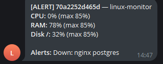

# 🖥️ Linux Monitor → Telegram

Минималистичный мониторинг CPU / RAM / Disk / процессов с алертами в Telegram.  
Можно запускать нативно или через Docker / Docker Compose.  

---

## Возможности
- Проверка загрузки CPU, RAM и диска по порогам
- Контроль критичных процессов (например, nginx, postgres)
- Уведомления в Telegram с HTML-разметкой
- Логирование в файл
- Запуск как нативно, так и в Docker
- Поддержка мониторинга хоста из контейнера (через pid: host и bind mounts)

---

## 📂 Структура проекта
├─ monitor.sh # основной скрипт  
├─ Dockerfile # сборка Docker образа  
├─ docker-compose.yml # запуск в одну команду  
├─ .env.example # пример конфигурации  
├─ .gitignore  
└─ README.md  

---

## 📸 Пример уведомления:

---

## Как запустить:

1. Клонировать репозиторий

git clone https://github.com/raynowww/linux-monitor-telegram.git  

2. Настроить переменные
cd linux-monitor-telegram   
cp .env.example .env      
nano .env    

4. Указать обязательные переменные:

TELEGRAM_TOKEN=xxx:yyy  
TELEGRAM_CHAT_ID=123456789  

---

🐳 Запуск в Docker Compose

docker compose build  
docker compose up -d  

## Если нужно просмотреть лог-файл:

docker logs -f linux-monitor

---

Нативный запуск:

cp .env.example .env  
chmod +x monitor.sh  
./monitor.sh  

